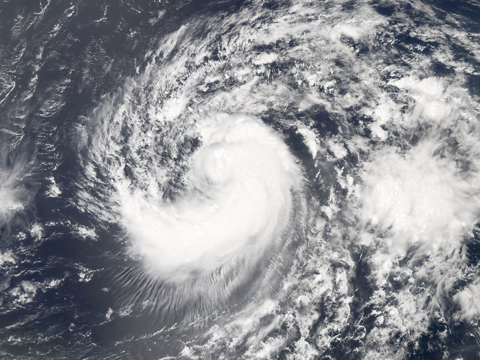

The project will analyze the impact of Hurricane Helene on voter turnout during the 2024 Presidential Election, focusing on counties affected by the hurricane in North Carolina, South Carolina, Georgia, Tennessee, and Florida. Specifically, it will assess spatial variation in voter turnout between disaster-affected and non-affected counties, how turnout changed between the 2020 and 2024 Presidential Elections, and how FEMA disaster aid influenced this variation. Her research team includes Andrew Reeves (co-PI), Bo Li (co-PI), and Kristin Foringer.

  
*Image source: [Internet Geography](https://www.internetgeography.net/hurricane-helene-2024-a-catastrophic-category-4-storm/)*
